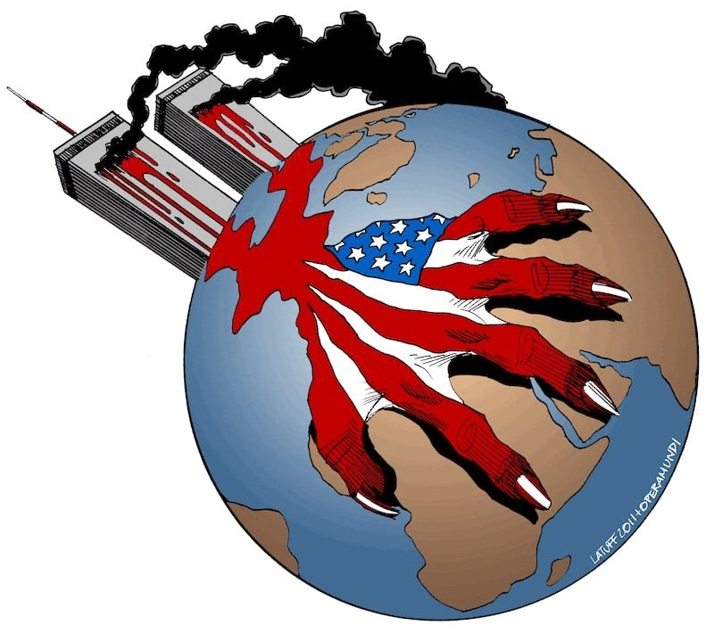

Before I begin this poem, I’d like to ask you to join me in a moment of silence in honor of those who died in the World Trade Center and the Pentagon on September 11th, 2001.

I would also like to ask you to offer up a moment of silence for all of those who have been harassed, imprisoned, disappeared, tortured, raped, or killed in retaliation for those strikes, for the victims in Afghanistan, Iraq, in the U.S., and throughout the world.

And if I could just add one more thing…

A full day of silence… for the tens of thousands of Palestinians who have died at the hands of U.S.-backed Israeli forces over decades of occupation.

Six months of silence… for the million and-a-half Iraqi people, mostly children, who have died of malnourishment or starvation as a result of a 12-year U.S. embargo against the country.

…And now, the drums of war beat again.

Before I begin this poem, two months of silence… for the Blacks under Apartheid in South Africa, where “homeland security” made them aliens in their own country

Nine months of silence… for the dead in Hiroshima and Nagasaki, where death rained down and peeled back every layer of concrete, steel, earth and skin, and the survivors went on as if alive.

A year of silence… for the millions of dead in Viet Nam­—a people, not a war—for those who know a thing or two about the scent of burning fuel, their relatives bones buried in it, their babies born of it.

Two months of silence… for the decades of dead in Colombia, whose names, like the corpses they once represented, have piled up and slipped off our tongues.

Before I begin this poem, Seven days of silence… for El Salvador A day of silence… for Nicaragua Five days of silence… for the Guatemaltecos None of whom ever knew a moment of peace in their living years. 45 seconds of silence… for the 45 dead at Acteal, Chiapas… 1,933 miles of silence… for every desperate body That burns in the desert sun Drowned in swollen rivers at the pearly gates to the Empire’s underbelly, A gaping wound sutured shut by razor wire and corrugated steel.

25 years of silence… for the millions of Africans who found their graves far deeper in the ocean than any building could poke into the sky. For those who were strung and swung from the heights of sycamore trees In the south… the north… the east… the west… There will be no dna testing or dental records to identify their remains.

100 years of silence… for the hundreds of millions of indigenous people From this half of right here, Whose land and lives were stolen, In postcard-perfect plots like Pine Ridge, Wounded Knee, Sand Creek, Fallen Timbers, or the Trail of Tears Names now reduced to innocuous magnetic poetry on the refrigerator of our consciousness…

From somewhere within the pillars of power You open your mouths to invoke a moment of our silence And we are all left speechless, Our tongues snatched from our mouths, Our eyes stapled shut.

A moment of silence, And the poets are laid to rest, The drums disintegrate into dust.

Before I begin this poem, You want a moment of silence… You mourn now as if the world will never be the same And the rest of us hope to hell it won’t be. Not like it always has been.

…Because this is not a 9-1-1 poem This is a 9/10 poem, It is a 9/9 poem, A 9/8 poem, A 9/7 poem… This is a 1492 poem. This is a poem about what causes poems like this to be written.

And if this is a 9/11 poem, then This is a September 11th 1973 poem for Chile. This is a September 12th 1977 poem for Steven Biko in South Africa. This is a September 13th 1971 poem for the brothers at Attica Prison, New York. This is a September 14th 1992 poem for the people of Somalia. This is a poem for every date that falls to the ground amidst the ashes of amnesia.

This is a poem for the 110 stories that were never told, The 110 stories that history uprooted from its textbooks The 110 stories that that cnn, bbc, The New York Times, and Newsweek ignored. This is a poem for interrupting this program.

This is not a peace poem, Not a poem for forgiveness. This is a justice poem, A poem for never forgetting. This is a poem to remind us That all that glitters Might just be broken glass.

And still you want a moment of silence for the dead? We could give you lifetimes of empty: The unmarked graves, The lost languages, The uprooted trees and histories, The dead stares on the faces of nameless children…

Before I start this poem we could be silent forever Or just long enough to hunger, For the dust to bury us And you would still ask us For more of our silence. So if you want a moment of silence

Then stop the oil pumps Turn off the engines, the televisions Sink the cruise ships Crash the stock markets Unplug the marquee lights Delete the e-mails and instant messages Derail the trains, ground the planes. If you want a moment of silence, put a brick through the window of Taco Bell And pay the workers for wages lost. Tear down the liquor stores, The townhouses, the White Houses, the jailhouses, the Penthouses and the Playboys.

If you want a moment of silence, Then take it On Super Bowl Sunday, The Fourth of July, During Dayton’s 13 hour sale, The next time your white guilt fills the room where my beautiful brown people have gathered.

You want a moment of silence Then take it Now, Before this poem begins. Here, in the echo of my voice, In the pause between goosesteps of the second hand, In the space between bodies in embrace, Here is your silence. Take it. Take it all. But don’t cut in line. Let your silence begin at the beginning of crime.

And we, Tonight, We will keep right on singing For our dead.

[A Moment of Silence](https://kersplebedeb.com/posts/silence/) by Emmanuel Ortiz