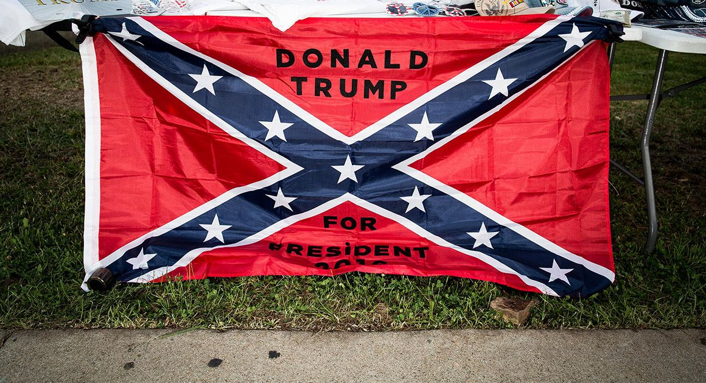

(originally written in 2015) I grew up with a southern-skewed perspective on the Civil War. Even in the 60’s and 70’s I occasionally heard it referred to as the War of Northern Aggression. The general idea was that the southern states were attempting to mind their own business and the northern states didn’t like our independence and wanted to quash states’ rights. Something like that.

The Civil War is a big topic, and I won’t rehash the many things done on both sides that we find distasteful today. But growing up southern was like growing up as a Chicago Cubs fan. No matter how much ‘southern pride’ you might have, we still got our asses kicked. For many years we were treated like the defeated rebels that we were.

Unlike other civil wars, however, there was no racial or religious divide between north and south. A resident of Alabama was free to move to Maine and start a new life. Many former slaves moved north, only to discover that true abolitionists were few, and that most northerners didn’t mind free slaves as long as they didn’t move in next door.

The confederate flag eventually included the blue x with stars on a red background in some shape, fashion or form. It was on the flag of the seceding slave states, and it is still used by the KKK and other white supremacist groups. For the average African American, it is a symbol of every form of evil and hate they and their ancestors have suffered through for centuries. To insist that it isn’t racist, and that it is merely a symbol of southern heritage, is to spit on the graves of every slave ever bought and sold here.

All of this seems simple to me now, but my fellow Texans disappoint me greatly. In the last week I have seen two punk kids riding bicycles with these flags flying from long poles, and a couple of trucks in the Wal-Mart parking lot doing the same. It seems I am destined to hate so many things in my home state and my country.

Fortunately they will soon be distracted by something else, like maybe the imminent federal invasion of the entire southwest US. (see JadeHelm)