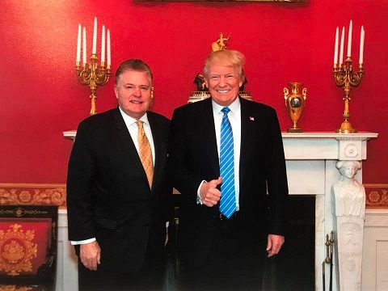

Our former pastor is this guy:
Jim Garlow. We used to attend his church. My wife and I married there, he and Carol attended our wedding. We have been in his home, even overnight. I can’t say that we were close friends, but I certainly know him.
Occasionally I see a mention of him in a news article, or see a video clip online. My wife saw something on Facebook today, and it prompted me to check out his timeline. It was a stark reminder of just how far I have come, how much I have changed. But he's changed as well.
His timeline is filled to the brim with radical right-wing opinion on gay rights and abortion and politics, and I now vehemently disagree with his position on every single thing he writes.

[Benhams Celebrate Fathers Day by Warning of Impending Persecution, God's Wrath](https://www.rightwingwatch.org/post/benhams-celebrate-fathers-day-by-warning-of-impending-persecution-gods-wrath/)

The link above is interesting because it is about Flip Benham and his two sons speaking at Garlow’s church. We once participated in an abortion protest after Flip Benham spoke at Garlow’s church in Texas (Metroplex Chapel). We protested at the Routh Street clinic in Dallas. I know why I did it, what I sincerely believed at the time, but I cringe at the memory. I know that I was sincere, and I guess Benham and Garlow are sincere as well. But sincerity only speaks to motive, not to veracity.
As it turns out, I was sincerely wrong.