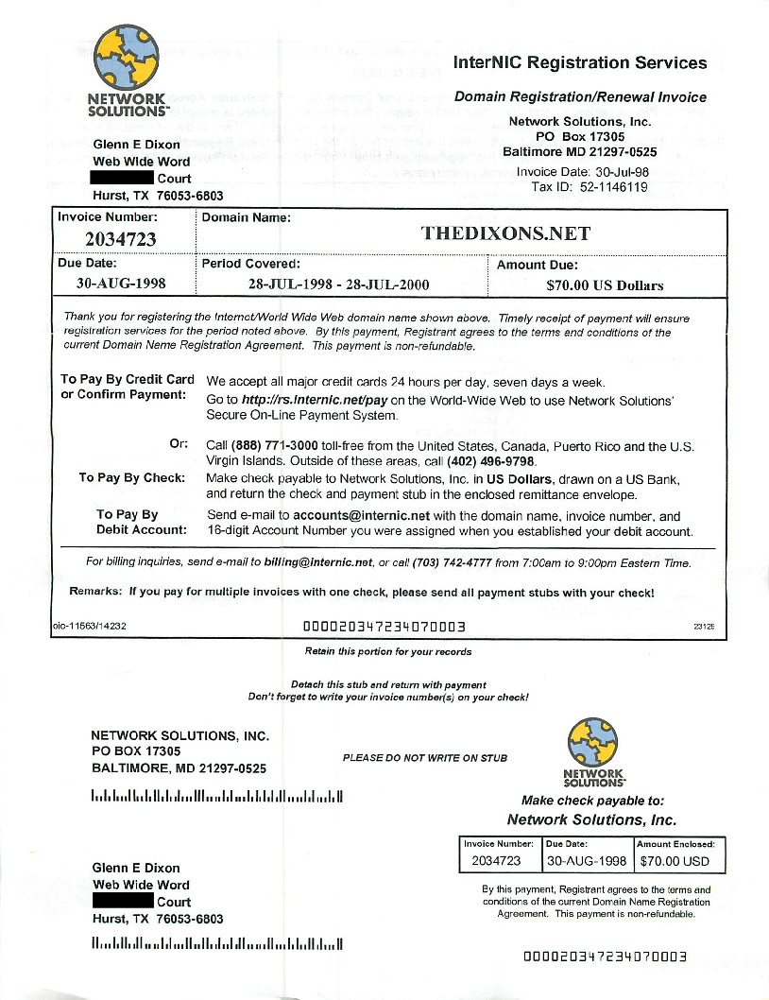

I can't believe I have owned a domain name for its entire 24-year history! This main domain ([thedixons.net](http://thedixons.net)) was first registered 24 years ago as of July 28, 2024. Here is a copy of the original domain name registration. $70 for two years! (click to embiggen)

I have changed the content so many times, it isn't even funny, but the focus was always my family history. Here is one of the earliest screenshots of my home page, courtesy of [Archive.org](../img/thedixons.net_archive.png)

Some interesting notes on that early version:

1.  That's some seriously minimalist html there!  
    
2.  Yes, my 'blog' was called The Daily Rant - hand-coded w/ vbScript, ASP, served via IIS and MSAccess  
    
3.  Yes, I had vacation pics and stories.  
    
4.  Yes, I had a really cheesy web company name (WWW=World Wide Web -> Web Wide Word) - get it, I was 'getting' the 'word' out on the web!!! Genius marketing there  
    
5.  Oh yes, I totally coded the whole thing using Note Tab Pro.  
    

Archive.org has grabbed 163 snapshots of the site in 24 years. There were periods where the site was not active as I kept changing my mind on servers, software and the overall focus.

I'm very proud of this, in a nerdy sort of way, of course. A personal domain was pretty rare back then. But I'm also proud at having the follow-through to still be here, with a renewed enthusiasm for the old days when one crafted their own content. This current  [Digital Garden](https://archive.org) concept on this subdomain (glenn.thedixons.net) is one result of that. Who knows, maybe some day this subdomain will have its own twenty-year history?