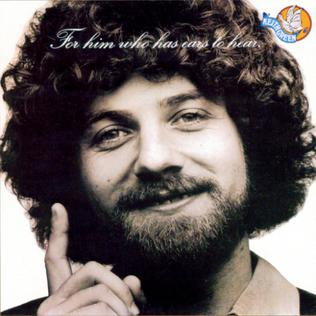
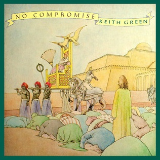
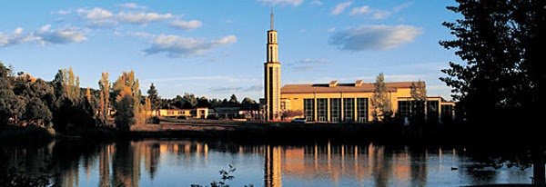
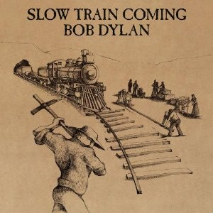
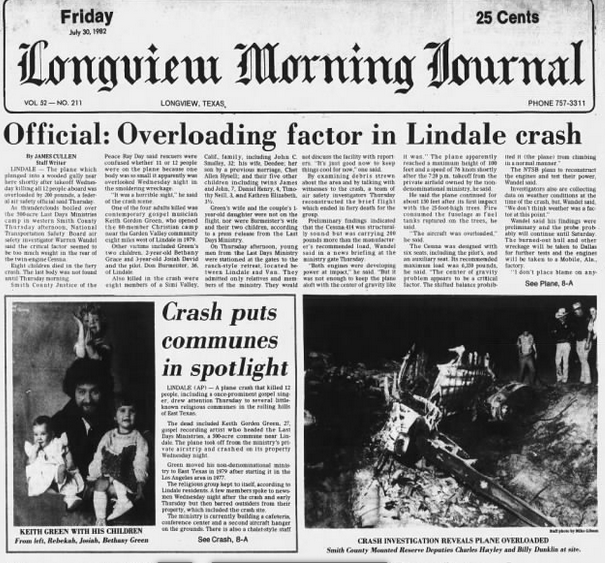
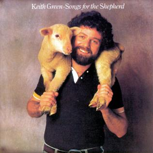
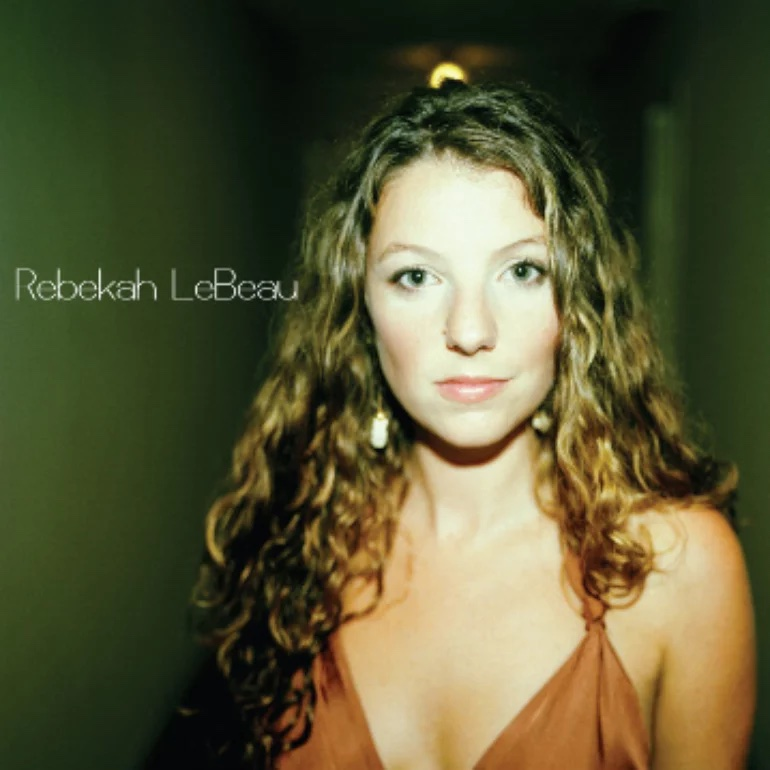

I discovered Keith Green when he was in the middle of what would be a brief but meteoric career as a Contemporary Christian Music (CCM) artist and evangelist. As I began looking back at our intersections, I had to wonder how it took me so long to find him. To begin with, I blame it on the radio.



When Keith’s first album For Him Who Has Ears To Hear hit the top of the CCM charts, I was living in an area sometimes referred to as the buckle of the ‘bible belt.’ The other buckle was Nashville. Tennessee had the headquarters of the Southern Baptist Convention, and Dallas had pastor Jim Criswell and his First Baptist Church, the largest in the denomination for many years. Living in the Dallas area, you would think that CCM would have had a natural audience, but we were too conservative for that tawdry ‘modern’ stuff. We liked hymns. CCM was so Hollywood.



And so it was that the only real burst of CCM airplay in the Dallas/Fort Worth area was a brief six-month span on KDMX - 102.9FM - from March through September of 1977. Keith probably got some airplay during that time, and I may have heard his music, but I don’t recall it. So our first opportunity to meet was missed, for better or worse.

In the summer after I graduated from high school I attended my final youth retreat with others from our church where my father was pastor. I ‘rededicated’ my life to the Lord and spent the rest of the summer in a haze of evangelical zeal. I moved to the campus of Dallas Baptist University a few weeks before the semester opened so that I could earn some ‘work study’ funds and began my life as a young adult.


Keith’s second album, the aptly named “No Compromise,” came out in late 1979. I believe it was some time in the spring of 1980 when I was riding in a car with some fellow students when they played a Keith Green 8-track tape. It was just background music to them, but I asked them to turn the music up and heard Keith singing “Asleep In The Light” with the uncompromising lyrics:

```
The world is sleeping in the dark,
That the church just can’t fight,
‘cause it’s asleep in the light!
How can you be so dead?!
When you’ve been so well fed
Jesus rose from the grave, And you!
You can’t even get out of bed!
```

The message and attraction couldn’t have been any clearer. This was an obvious appeal to fundamentalism, and it definitely appealed to me. It was a ‘moth-to-the-flame’ attraction. Keith railed against complacency and how religion had become compromised. This came out in many of his early songs. And not only was he a singer, but he had a ministry. By the time I discovered Keith he had not only released his second album but his ministry headquarters had moved from California to Texas, less than two hours from the college I was attending. I bought a cassette tape or two and practically wore them out. I began receiving his Last Days Newsletter (later Magazine) and devoured each issue, each article. I bought song books and began playing them all on the piano. I was obviously tackling someone with downright virtuoso skills, both vocally and on the keyboard, but I was that drawn to his music.

Over the next several years this mentality ruled my life. I was zealous, uncompromising, condescending and a general pain in the neck. Woe be unto any one within earshot if the conversation veered into religion. Of course at the time I considered myself a very reasonable person who just happened to be initiated into something that most people were not. I don’t think I made a total ass out of myself but even my dad didn’t pass muster when it came to my new spiritual guidelines. Not even the local churches, including the huge First Baptist Dallas, could satisfy my hunger for uncompromising religion. I usually just played and sang at a piano somewhere on Sunday mornings rather than attend a church. My relationship with Keith was one of deep passion and emotion which I can still feel thirty forty(!) years later any time I hear his music.

I spent the summer of 1980 as a staff member of a Baptist ‘encampment’ in the hills above Santa Fe, New Mexico. Glorieta was one of two major places where Baptists spent time during summer vacation. Each week had a special emphasis, either on training for Vacation Bible School, or Sunday School, or music or youth work. As a staff member, we received pay that was below minimum wage but included free room and board.



There were three primary musicians in my life that summer, as far as music that I listened to goes. One was the surprising discovery that Bob Dylan was now a Christian. I later learned that part of what brought this about was some correspondence and conversation between him and Keith Green. The cassette tape I picked up was Dylan’s “Slow Train Coming” which had been released the previous fall. Unlike much of Christian Music this recording was performed by seasoned music pros and marked a change of heart for one of the premier icons of the rebellious 60’s generation. And I just flat out liked the songs, the beats, the words. It was good stuff. It inspired me.



Another album was from the old southern gospel group The Imperials. They had a new CCM sound and Russ Taff’s lead vocals were awesome. Probably not a bad song on the whole album, but I always think of New Mexico when I hear the Eagle Song. Lots of synthesized strings and mellow goodness, smooth mellow vocals, and the lyrics “I stood and watched an eagle fly, spread his wings and soar across the sky, so gracefully he flew…” Again, it was an almost perfect match for the majesty of the mountains.

And, of course, there was Keith Green. I began collecting all of his recordings that I could, and a group of staffers went to see him when he did one of his rare concerts that summer in Albuquerque. Unfortunately his zeal and passion was so intense that it suppressed all possible logical and rational thought and struck as an arrow to the heart, inflaming emotional responses like the best and worst of history’s cult leaders and megalomaniacs. His sincerity and desire to do the right thing was never in question, his belief that he was doing God’s bidding is a given. But it set up a war within my soul, and probably within the souls of many other thousands of youth across the country. He espoused the view that one was called to the mission field by default, and that only upon hearing a definitive opposing calling from the Lord should one do anything else. Like anything theological one can argue both sides of the issue and find plenty of scripture to back up your position, but his message was compelling. Of course most left the auditorium that day and never took any serious action toward becoming a missionary, but that doesn’t mean that the thought leaves the mind. Instead it hangs around the periphery only to pop out with an occasional twang of guilt at appropriate opportunities. Thus, the internal struggle was set in motion.

I also met Deeanne, my first wife, that summer. At some later point we saw Keith Green in concert in Austin, Texas. The building was normally used for wrestling events, and they actually reinforced the canvas (with plywood, I presume) and put the piano in the ring. Keith used the rather obvious prop as an analogy to spiritual warfare. “And in this corner…” As usual, Keith was intense and evangelized as much as he sang.

We were probably visiting family in Georgetown, which was fairly frequent for us since we lived at the time in the Dallas area. On one of these trips back home we heard a news break on the radio. A small plane had crashed near Lindale, Texas and it was believed that all on board were dead. Deeanne and I looked at each other. We knew. Keith Green was no more.



We were stunned. Our only source of information was news from Christian radio stations. The plane was overloaded. There was no other way to look at it. What was difficult was figuring out why God had allowed such a thing to happen. Keith was gone, two of his children were gone. An entire family of seven was gone. And the pilot was gone. But never underestimate the ability of the true believer to find reinforcing answers, no matter how illogical or irrational, to the questions of life. My personal favorite was the idea that perhaps Keith was about to fall into sin and that God had ‘taken him home’ to spare the rest of us from the tragic fallout of such. Most answers that were proposed were some variation on the ‘when life gives you lemons, make lemonade’ line of thinking. Of course this begs the question of why God allowed the lemon in the first place.



Within a week of his death we received our pre-ordered copy of his new album Songs for the Shepherd. I cried as I listened. The next Saturday we drove to Lindale and found the Last Days Ministries headquarters. We drove around and found a nearby church and found the gravesite. It still had memorial wreaths from other ministries and organizations and the dirt mound was still there. We ‘paid our respects’ and probably prayed asking God to make us more like Keith. I wouldn’t see that gravesite again for ten years.

Within a few years Deeanne and I divorced. Neither of us actually decided and determined that we wanted out, but neither of us could keep it from happening. It just did. The list of incompatibilities was a long one.

We both spent some time recovering from this. We both did a lot of drugs. A few years later I had finally had enough and got back into church. I buried myself in volunteer work at a local venue which held CCM concerts each weekend. One such weekend, for reasons I don’t remember, Keith’s widow Melody and her two daughters showed up. I saw them in our snack bar area briefly, and I think I may have exchanged a few words, but nothing significant.

During this time I also met and married Bryn. We recently celebrated our 30th Anniversary, so I guess we did something right. While I attempted to turn her on to Keith Green’s music, I’m not sure she ever quite got the attraction. So much of it was tied up into my own youth, my own fundamentalist childhood and memories intertwined with my first marriage that I just don’t think it translated.

We frequently enjoyed road trips, something my parents passed on to me, and one weekend I took her to Lindale. We found the Last Days Ministries compound and the church where Keith’s grave was located. As we walked to where I remembered his grave to be, we saw a woman in the vicinity, sitting on a headstone. Out of a sense of respect, we stopped short and wandered around, looking at other grave sites. She soon left, and we made our way to that corner of the cemetery. In fact, we made our way to the very headstone she had been sitting on! I couldn’t believe the timing! What were the odds that I would randomly show up on the same day that Melody was visiting? And then I looked at the headstone: July 28, 1982.

It was the tenth anniversary of his death.

My heart sunk! We had chased Keith’s widow away on a day when she should have been able to visit and think and reminisce all she wanted. I felt so bad that when we got back home I promptly emailed Melody to apologize. Surprisingly, she actually responded! She was gracious, and even scolded herself for being out there to begin with. I gave her the benefit of the doubt. It wasn’t a lengthy email exchange back and forth, but I was glad to have been able to apologize and to know that I hadn’t caused any sort of trauma. Up until now, it was my last interaction with anything or anyone related to Keith’s ministry.

I had loved Keith for all the wrong reasons, and all the right reasons. He was so many things I aspired to be. His tenacity and dedication to perfecting his musical craft was an example, his golden tenor voice was how I sounded in my own head, and his dedication to finding his way to true Christian obedience and perfection was unsurpassed. His personality had always been one of ‘no compromise’ but at the time I was unaware of his history prior to his conversion. I saw his all-or-nothing approach as closely matching my own fundamentalist mindset. To me he wasn’t just being Keith, he was obeying scripture.

All of these things were truly the wrong reasons to love him. They are in many ways the worst part of fundamentalist Christianity. Given the plasticity of the Bible, any attempt to take one particular interpretation and turn it into absolute law usually results in disaster, with a pile of bodies in its wake. Keith’s personality combined with fundamentalism often hurt those he loved the most.

But there was good in there. Keith took concepts to their natural conclusions. Even while rising to stardom within the Christian music world he challenged the validity of the system itself. When he headlined the Jesus Northwest festival in 1978 he was so aware of the hypocrisy that it caused him great distress. He viewed himself as somewhat of a prophet because of such inner dialog. His relief valve was to castigate the 35,000 people in attendance. In effect, they wound up paying money to go to a festival so that the main attraction could chastise them and spew Bible verses at them about how much God hated festivals and songs! This couldn’t have pleased the PR people at Sparrow Records, or the festival sponsors, but it endeared him to the fundies, his core audience.

He also believed in the Gospel challenges of Jesus to “Go” and followed that line of thinking out to its logical conclusion as well. His entire ministry shifted to one of challenging people to do missions work as the default ‘calling’ of God, unless they heard from Him otherwise. Most of the church viewed things the other way around, with the default position being one of slavish servitude and devotion (and tithing) unless you heard from God otherwise. I still enjoy the general thought of Keith ‘sticking it to the man’ in that way, misdirected and misguided though he may have been.

In conclusion, if that is possible, I find it interesting that I still have such fond memories of someone who was so rabidly Christian. As an atheist, that is pretty rare. I do, however, have fond memories for different things in my life, as does everyone. It’s just human nature to remember certain places and people and periods with fondness. But when I rejected Christianity several years ago it obviously affected the possibility of happy reunions. It is difficult to show up to church or Christian-related gatherings when everyone is talking about their wonderful ministry paths. Ending my story with “and then we stopped going to church and became atheists” is quite a show-stopper. True, I have very little in common with those people any more, but that doesn’t mean that I can’t value those times or laugh at shared memories.

The same holds true for my love of Keith Green. The emotional ties are strong because religion is such an emotional experience, especially the fundamentalist variety. But I would be quickly unwelcome at a “we love Keith Green” event since I no longer share the religious views. But that’s ok with me. I can still admire and respect his talent and brazen audacity from the outside. I no longer worship him in the way I did, and I no longer value any of his ministry goals, but reading about his life can still make me smile and laugh at his antics, and still make me sad and misty-eyed at the way it all ended.

So yeah, this atheist still has a very warm place in his heart for one of the most all-out, sold-out Christian music artists of all time. That’s just how I roll.

——————————————-

A few end notes here…

First, for those of you who may read this as a believer, I know what you’re thinking! No, seriously, I do! LOL (remember, I was a fundy Christian for over 40 years!) You’re thinking about praying for me. You’re thinking that my fondness for Keith is really the power of the Spirit working on my heart. You’re thinking that I’m ripe for re-conversion. Uh, NO. Hate to burst your bubble and all, but I’m the type of atheist that believes the entire Bible is myth and legend, including the part about an actual historical Jesus. Memories of Keith can’t overcome that.

Second, I have been trying to remember why I started thinking about Keith to begin with. In my previous post I mentioned Keith’s daughters. The other day it dawned on me that they would be close to thirty years old now! Wow, that made me feel old! So I did some Googling and I found them! Melody was only three months pregnant with Rachel (now Taylor) when Keith died, and she has pretty much turned out like you would expect. She is married to a worship leader and has kids of her own, keeping Melody busy as a grandmother. That’s a happy story.



Rebekah (now LeBeau) was about one year old when Keith died. She has no memory of him. She and her husband both graduated from Wheaton College, which is a conservative Christian institution. And yet she had been working on a music career, had a couple of potential bites, but all secular. I found that refreshing, and I hope that she feels free to do what she wants without worrying about all of Keith’s fans and their approval.

Third, and last, during my research for this post I found something utterly glorious - several of Keith’s pre-Christian recordings! There are about 13 songs available on iTunes. Some are from a live concert at a college in Albuquerque, New Mexico when Keith was only 18! Check ‘em out here:

[The Early Word](https://music.apple.com/us/album/the-early-word-ep/306226453)

[Keith Green Live](https://music.apple.com/us/album/keith-green-live/442041268)