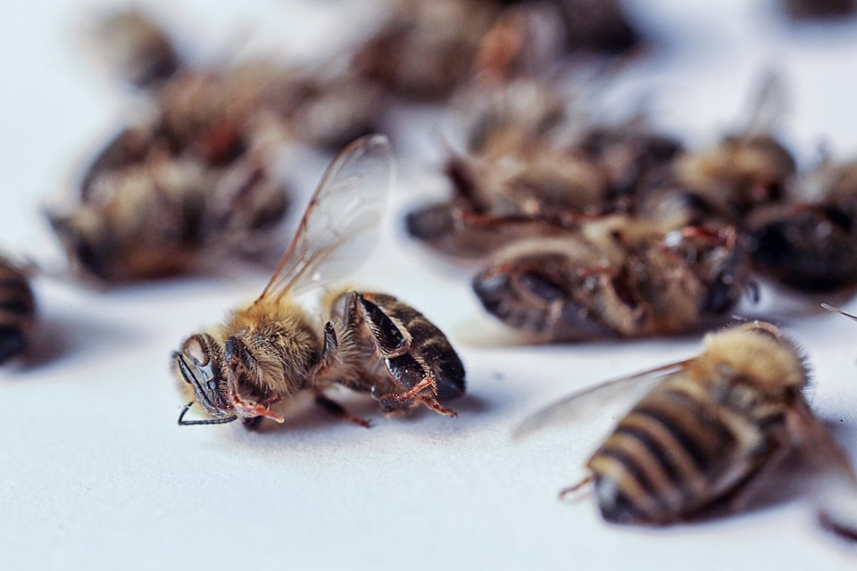

#### Threat Headlines

[The global ecosystem is rapidly collapsing… insect biomass plummets 75% in one generation… scientists warn of “decimation”… humanity may not survive much longer](https://www.naturalnews.com/2017-10-19-the-global-ecosystem-is-collapsing-insect-biomass-decline-decimation-pollinators-scientists.html)

[Warning of ‘ecological Armageddon’ after dramatic plunge in insect numbers](https://www.theguardian.com/environment/2017/oct/18/warning-of-ecological-armageddon-after-dramatic-plunge-in-insect-numbers)

#### Source

[More than 75 percent decline over 27 years in total flying insect biomass in protected areas](https://journals.plos.org/plosone/article?id=10.1371/journal.pone.0185809)

[Worldwide decline of the entomofauna: A review of its drivers](https://www.sciencedirect.com/science/article/abs/pii/S0006320718313636)

#### Claims

"Over 40% of insect species are threatened with extinction." - entomofauna paper

#### Problems

##### Biomass study

> "In this study, over half (59%) of the trap locations were only surveyed for one year during the 27 year period. And only 26 sites were surveyed in multiple (2, 3 or 4) years – these were not all consecutive years. " - [Insects in decline: why we need more studies like this](https://ecologyisnotadirtyword.com/2017/10/20/insects-in-decline-why-we-need-more-studies-like-this/)

##### Entomofauna review

"From a scientific perspective, there is so much wrong with the paper, it really shouldn’t have been published in its current form: the biased search method, the cherry-picked studies, the absence of any real quantitative data to back up the bizarre 40% extinction rate that appears in the abstract (we don’t even have population data for 40% of the world’s insect species), and the errors in the reference list. And it was presented as a ‘comprehensive review’ and a ‘meta-analysis’, even though it is neither." - [Moving on from the insect apocalypse to evidence-based conservation](https://ecologyisnotadirtyword.com/2019/12/20/moving-on-from-the-insect-apocalypse-to-evidence-based-conservation/)

"Yet other insects are not declining, and some are increasing in population size or range distribution. New species are being named every year, most of which we still know nothing about. Presenting the global decline narrative as consensus or fact is simply misrepresentation of science." - (same article)

"Based on current knowledge, it’s actually impossible to predict extinction rates for the 1 million species of insect known to science. This is because the vast majority of them have been left unstudied, some are still in museum drawers waiting to be named. It’s extremely difficult to predict an extinction rate of a species without data on its population distribution, dynamics and ecological interactions." - [Are 40% of Insects Facing Extinction?
](https://ecologyisnotadirtyword.com/2020/01/22/are-40-of-insects-facing-extinction/)
#### Conclusions

My main source for these contrarian views is Manu Saunders, an ecologist at the U. of New England (Australia, not U.S.). While she intends to set the record straight on what she considers ‘hype’ surrounding some recent insect studies, she truly believes insect populations are threatened by direct human impact as well as indirectly via climate change. She’s no denier.

In her article about the ‘entomofauna’ paper, she laid out the problems with the study and it’s media hype, but added this caveat:

> "(N.B. I’m not suggesting the authors intentionally set out to publish flawed science. I think the scientists that built and maintained the apocalypse hype had good intentions and genuinely thought they were helping the insect conservation cause.)"

I have a few issues with this. First, she refers to ‘apocalypse hype’ as being built and maintained by scientists - since when is this something scientific? Since when do scientists believe they are tasked with building hype? Second, since when do scientists have causes? I’m not saying this to be naive, but is it now accepted that they should? This is perfectly normal?

Bottom line on insects, given the current system I am not hopeful that we will ever have more than a glimpse into the actual number of species or their populations. Sampling miniscule slivers of this vast population and extrapolating supposed ‘trends’ from it is ludicrous on its face. I’d be glad to see agriculture and forestry take a more eco-friendly approach, but not at the risk of falling behind in our ongoing battle to feed humans. I think we can do both. That’s the real struggle, and that is where we should be focusing.