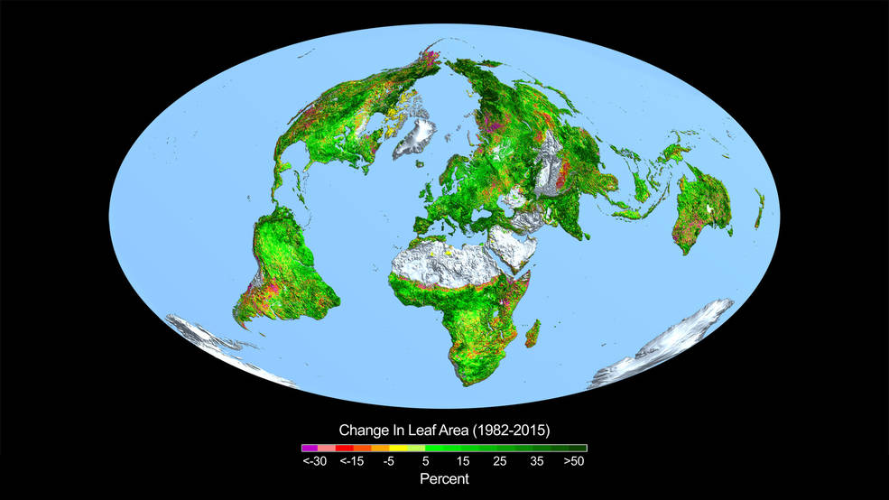

“It is simply no longer possible to believe much of the clinical research that is published, or to rely on the judgment of trusted physicians or authoritative medical guidelines. I take no pleasure in this conclusion, which I reached slowly and reluctantly over my two decades as an editor of the New England Journal of Medicine.”

[Drug Companies & Doctors: A Story of Corruption - Marcia Angell](https://www.nybooks.com/articles/2009/01/15/drug-companies-doctorsa-story-of-corruption/?pagination=false)

[last updated June 27, 2021 6:31 AM (MDT)]

Before I lost my faith in science, I lost my faith in the religion of my childhood, fundamentalist christianity.

Fundamentalists, in my case the Southern Baptist variety, were generally anti-intellectual and anti-science. When anything or anyone contradicted the words in the Bible, you sided with the Bible. My childhood was a world of talking snakes and donkeys, seven-day creations, a young earth, miracles and lots of prohibitions. Unlike a lot of other people who managed to reason their way out of the fog of religion at an early age, I remained firmly indoctrinated until I was forty years old. Here you can read more about my deconversion process.

Geology and math helped, and part of my recovery involved lots of helpful science books by authors like Carl Sagan. Along the way I gained a great appreciation for the scientific process and science in general. I was able to finally understand evolution and the age of the universe and many other things.

More recently science has been running into problems. Some is political, some comes from the Journal system of ‘publish or die’ and the flawed peer review process, plus the replication crisis. In this series I want to document my discovery of these issues and how they have affected my trust in science (but not the scientific process).

These are intended to be evergreen notes - they should progress from an initial set of thoughts and links into a more organized outline form, eventually (hopefully) a cogent set of articles. They may never be complete or static.

Additional general info:

[The Moderate-minded Writer](https://mattnisbet.substack.com/p/the-moderate-minded-writer?s=r)