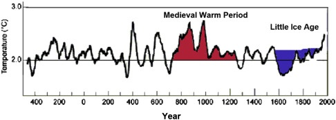
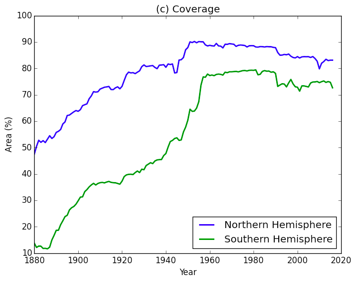
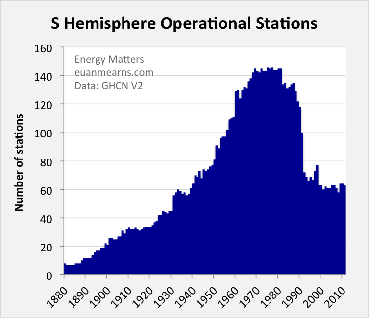

This is perhaps too large a topic for one blog post. I have just finished reading dozens of articles on this topic. Even after correcting for possible motive/bias issues, and after weeding out ad hominems, I am left with the following conclusions:

The temperature dataset from 1850-1906 or so covers less than 50% of the globe.

The Southern hemisphere data coverage reached 50% only in 1950.

Source: https://data.giss.nasa.gov/gistemp/station_data_v3/

Global averages for a century were created by combining the sparse Northern hemisphere averages with the almost non-existent Southern hemisphere averages Source: [UPDATE – BOMBSHELL: audit of global warming data finds it riddled with errors](https://wattsupwiththat.com/2018/10/11/bombshell-audit-of-global-warming-data-finds-it-riddled-with-errors/) (given the source, adding further info since some can’t bring themselves to click it:

1 - JCU - the university which awarded the PhD to the individual who wrote [the thesis in question](https://researchonline.jcu.edu.au/52041/)

2 - [the paper’s publisher’s web site](https://robert-boyle-publishing.com/product/audit-of-the-hadcrut4-global-temperature-dataset-mclean-2018/)

Making any claim about current global temperature trends compared to the past is therefore rendered meaningless.

In 1987 NOAA commissioned a study. It showed no warming trend in the U.S. from 1895-1987 Source: [U.S. Data Since 1895 Fail To Show Warming Trend](https://www.nytimes.com/1989/01/26/us/us-data-since-1895-fail-to-show-warming-trend.html?src=pm)

It is perfectly safe to say that the earth has been warming since the end of the last ice age.

It is not perfectly safe to say that the last century contains a signature to prove accelerated temperature rises are occurring, or that they are anthropogenic.

It is not safe to conclude that CO2 at .0415% of the atmosphere is significant of anything.

It is not safe to conclude that CO2’s correlation with temperature is consistent historically, or predictive.

It is also not safe to say that any climate model can possibly handle the complexity of forecasting future global temperature averages based on CO2 levels.

From the Jan. 18, 2020 edition of ‘The Week That Was’ from [The Greenhouse Effect – Different Results](http://www.sepp.org/twtwfiles/2020/TWTW%201-18-20%20last.pdf)

> Since the greenhouse effect of CO2 declines per unit as the total amount increases (diminishing returns), the expected increase in temperature from growing CO2 emissions by the end of this century is less than 1 ⁰K (C).

From ‘The Art and Science of Climate Model Tuning’:

> The increase of about one Kelvin of the global mean temperature observed from the beginning of the industrial era, hereafter 20th century warming, is a de facto litmus test for climate models. However, as a test of model quality, it is not without issues because the desired result is known to model developers and therefore becomes a potential target of the development.

(excerpt from Judith Curry’s blog) [The Art and Science of Climate Model Tuning](https://judithcurry.com/2016/08/01/the-art-and-science-of-climate-model-tuning/)

* [ ] To do: Need to explore analogy between markets and climate. Large, chaotic systems. Models backtested and tuned, equally useless for forecasting.